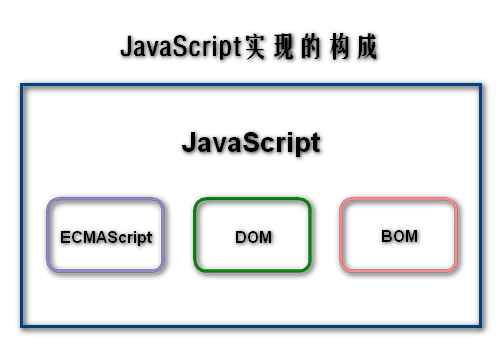

# 第一章 JavaScript简介
## 1.1 JavaScript简史
JavaScript诞生于1995年。最初只是在客户端浏览器上进行一些用户输入数据的校验工作。经过多年的发展，JavaScript已经成为了一门功能全面的编程语言，并成为Web的重要组成部分。

JavaScript语言即简单又复杂，说它简单是因为初学者可以很快上手掌握JavaScript，说它复杂是因为要真正深入掌握这门语言需要很漫长的时间。

1995年2月就职于Netscape的布兰登·艾奇开发了一种名为LiveScript脚本语言。随这年媒体对Java语言的热炒，Netscape把LiveScript改名为JavaScript，所以可以把JavaScript和Java之间的关系戏称为“雷锋和雷峰塔”之间的关系。

在JavaScript 1.0获得成功后，Netscape又推出了其1.1版本。但在当时还没有标准规范来定义JavaScript的语言特性和语法。而微软此时在IE 3中加入了被称为JScript的JavaScript实现。这意味着出现了两种JavaScript的不同实现版本，如果任由它们各自发展下去，JavaScript和JScript最终会成为作用相似但写法相异的两种编程语言。所以业界将JavaScript的标准化提上议事日程。

1997年，以JavaScript 1.1版本为蓝本的建议被提交给欧洲计算机制造商协会（ECMA），该协会指定39号技术委员会负责标准化一种“通用的、跨平台的、供应商中立的脚本语言的语法和语义”，经过数月努力完成了ECMA-262标准，即ECMAScript脚本语言标准。第二年，国际标准化组织和国际电工委员会（ISO/IEC）也采用了ECMAScript标准（ISO/IEC-16262）。从此各浏览器开发商就开始致力于把ECMAScript标准作为各自JavaScript实现的基础。

## 1.2 JavaScript实现
JavaScript的含义要比ECMAScript标准更加丰富。JavaScript由三个不同的部分组成（图1-1）：

- 核心（ECMAScript）
- 文档对象模型（DOM）
- 浏览器对象模型（BOM）

**图1-1 JavaScript实现的构成**

### 1.2.1 ECMAScript
ECMAScript并不依赖于Web浏览器。ECMA-262标准定义的只是语言的基础。Web浏览器只是ECMAScript实现的一种宿主环境，宿主环境除了对ECMAScript提供基本实现外，也提供了该语言的扩展，以便让环境和语义之间进行交互。例如使用浏览器的DOM扩展可以利用ECMAScript的核心类型和语法来完成更多功能。其它宿主环境包括Node和Adobe Flash。

ECMA-262标准规定了以下语言的组成部分：

- 语法
- 类型
- 语句
- 关键字
- 保留字
- 操作符
- 对象

ECMAScript就是对以上各方面内容的语言描述的实现。JavaScript和Adobe的ActionScript都实现了ECMAScript。

### 1.2.2 文档对象模型（DOM）
DOM是针对于XML（后经扩展可用于HTML）的应用程序编程接口（API）。DOM把整个文档映射为一棵由多层节点构成的树形结构。DOM定义了多种类型的节点，它们包含不同类型的数据。

借助DOM提供的API，开发人员可以控制文档的内容和结构。

### 1.2.3 浏览器对象模型（BOM）
BOM支持开发人员访问和操作浏览器窗口。

对处理浏览器窗口和框架的处理及所有针对浏览器的JavaScript扩展都被算作BOM，即以下扩展：

- 弹出新浏览器窗口
- 移动、缩放、关闭浏览器窗口
- 提供浏览器详细信息的navigator对象
- 提供浏览器所加载页面详细信息的location对象
- 提供用户显示器分辨率详细信息的screen对象
- 对cookies的支持
- 如XMLHttpRequest和IE的ActiveXObject之类的自定义对象

BOM虽然是JavaScript实现的一部分，却没有相关标准。此问题在HTML5中得到解决。

