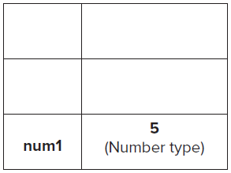
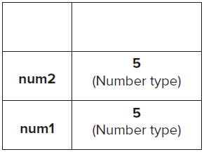
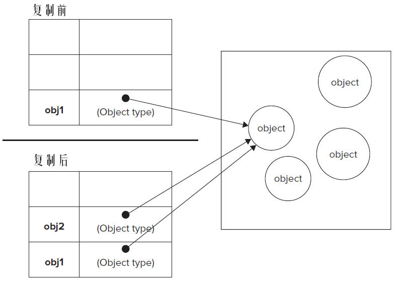

# 第四章 作用域和内存问题

JavaScript中的变量与其它语言有很大区别。在JavaScript中的变量只是在特定时间保存特定数据的一个名字而已。不存在某个变量必须保存某种数据类型值的规则。

## 4.1 基本类型和引用类型的值

ECMAScript变量可以包含基本类型和引用类型的值。在把一个值赋给变量时，解析器必须确定这个值是基本类型值还是引用类型的对象。

对于五种基本类型：Undefined、Null、Boolean、Number、String的变量是按值访问的，因为可以操作保存在变量中的实际值。

引用类型的值是保存在内存中的对象。JavaScript不允许直接访问内存中的地址，即不能直接操作对象的内存空间。

### 4.1.1 动态的属性

定义基本数据类型和引用类型的值都是创建一个变量并为其赋值。但是对于引用类型值，可以为其添加、改变、删除属性和方法。

```
// 定义了一个引用类型的值
var cat = new Object();
// 为cat对象添加了一个name属性
// 如果对象不被销毁或此属性不被删除，则name属性一直存在
cat.name = "铁蛋儿";
console.log(cat.name);// "铁蛋儿"
```

对于基本类型的值添加属性是无效的。

```
var s = "Test";
s.age = 30;// 虽然没有语法错误，但age无效
console.log(s.age);// undefined
```

### 4.1.2 复制变量值

基本类型与引用类型在变量的复制上也存在不同。

在复制基本类型值时，会把原始变量的值复制给新变量的内存地址中。

```
var num1 = 5;
var num2 = num1;
```

复制前：


复制后：


num1和num2中的值相互独立，互不影响。

```
var num1 = 5;
var num2 = num1;
num1 = 100;
console.log(num1);// 100
console.log(num2);// 5
```

在复制引用类型变量时，会把原始变量中保存的对象指针复制给新的变量，即两个变量同时指针相同，共享一个内存中的对象。

```
var obj1 = new Object();
var obj2 = obj1;// obj1和obj2都指向了同一个内存中的对象
obje.name = "Nicholas";
console.log(obj2.name);// "Nicholas"
```



### 4.1.3 传递参数

ECMAScript中函数的参数都是值传递的，即把函数外部的值复制给函数内部的参数，这与变量间的复制相同。

在向参数传递基本类型的值时，被传递的值会被复制给一个局部变量（即命名参数）。在向参数传递引用类型的值时，会把对象的引用地址复制给一个局部变量（即命名参数），所以这个局部变量的变化会反映在函数外部。

```
function addTen(num){
	num = num + 10;
	return num;
}

var count = 20;
var result = addTen(count);// count被复制了一份并传递到addTen函数中，count原始值没有被改变
console.log(count);// 20
console.log(result);// 30
```

```
function setName(obj){
	obj.name = "Tom";
}

var p = new Object();
setName(p);
console.log(p.name);// "Tom"
```

```
function setName(obj){
	obj.name = "Tom";// 函数外部变量和内部参数变量都添加了一个name属性，值均为"Tom"
	obj = new Object();// 参数变量指向了一个新对象，而外部变量的引用没有变化，这个局部对象在函数执行完成后会被销毁
	obj.name = "Mike";// 新对象的name属性为"Mike"
}

var p = new Object();
setName(p);
console.log(p.name);// "Tom"
```

### 4.1.4 检测类型

typeof是确定一个变量是字符串、数值、布尔值、undefined的最佳工具。如果变量的值是null则typeof会返回"object"。

```
var s = "Nicholas";
var b = true;
var i = 22;
var u;
var n = null;
var o = new Object();
console.log(typeof s); //string
console.log(typeof i); //number
console.log(typeof b); //boolean
console.log(typeof u); //undefined
console.log(typeof n); //object
console.log(typeof o); //object
```

如果想检测某个对象是属于什么类型的对象，则应该使用instanceof操作符。

格式为：变量 instanceof 类型构造函数

```
console.log(person instanceof Object);// 检测person的值是不是Object类型
console.log(arr instanceof Array);// 检测arr的值是否是Array类型
console.log(pattern instanceof RegExp);// 检测pattern是否是RegExp类型
```

检测一个引用类型是否是Object类型时永远返回true；检测一个引用类型是否是基本类型时永远返回false。

## 4.2 执行环境及作用域

每个执行环境都有一个与之关联的**变量对象**，环境中定义的所有变量和函数都保存在这个对象中。代码中无法使用这个对象，但解析器会在后台使用它。

最外围的执行环境是全局执行环境。在Web中全局执行环境被认为是window对象，所有所有全局变量和函数都是作为window对象的属性和方法创建的。

某个执行环境中的所有代码执行完毕后，此环境会被销毁，保存在其中的所有变量和函数也被销毁，全局环境会在关闭网页或浏览器时被销毁。

每个函数都有自己的执行环境。当执行流进行一个函数时，这个函数的环境就会被压入环境栈，而在函数执行之后，栈将其弹出，控制权交还给之前的环境。

当代码在一个环境中执行时，会创建变量对象的一个作用域链。作用域链的用途是保证对执行环境有权访问的所有变量和函数的有序访问。

作用域链的前端始终都是当前执行的代码所在环境的变量对象。如果这个环境是函数则将其活动对象作为变量对象。活动对象在最开始时只包含一个变量，即arguments对象（其在全局环境中不存在）。作用域链中的下一个变量对象来自外部环境，再下一个变量对象则来自更外层的外部环境，如此一直延伸到全局执行环境。全局执行环境的变量对象始终都是作用域链中的最后一个对象。

标识符解析是沿着作用域链逐级搜索标识符的过程。搜索过程始终从作用域链的前端开始，然后逐级向后回溯，直至找到标识符为止，如果找不到则导致错误。

```
var color = 'blue';
function changeColor(){
	if(color === 'blue'){
		color = 'red';
	} else {
		color = 'blue';
	}
}

changeColor();
console.log(color);// "red"
changeColor();
console.log(color);// "blue"
```

以上代码中函数changeColor()的作用域链包含两个变量对象：它自己的变量对象和全局环境中的变量对象。因为变量color出现在函数changeColor()函数的作用域链上，所有可以在此函数内部访问它。

```
var color = "blue";
function changeColor(){
	var anotherColor = “red”;
	function swapColors(){
		var tempColor = anotherColor;
		anotherColor = color;
		color = tempColor;
		//这里可以访问color、anotherColor和tempColor
	}
	// 这里可以访问color和anotherColor，但不能访问tempColor
	swapColors();
}

// 这里只能访问color
changeColor();
```

以上代码中涉及3个执行环境：全局环境、changeColor()局部环境和swapColors()局部环境。内部环境可以访问到外部环境定义的变量和函数，而外部环境访问不到内部环境中定义的变量和函数。函数的参数会被当作变量对待，访问规则与执行环境中的其他变量一致。

### 4.2.1 延长作用域链

有些语句可以在作用域链的前端临时增加一个变量对象，以达到延长作用域链的效果，此变量对象会在代码执行后被移除。

进行以下两类语句时，作用域链会被加长：

- try-catch语句中的catch块
- with语句

两种语句都会在作用域链的前端添加一个变量对象。对with语句而言会把指定的对象添加到作用域链中。对于catch语句，会创建一个新的变量对象，其中包含的是被抛出的错误对象。

```
function buildUrl() {
	var qs = “?debug=true”;
	with(location){
		var url = href + qs;// 在with语句块中定义的url变量可以被外部环境访问
	}
	return url;
}
```

### 4.2.2 没有块级作用域

JavaScript与C、C++、Java等语言不同，它没有块级作用域。

```
if(true){
	var color = "red";
}

console.log(color);// "red"
```

以上代码在Java等语言中，color变量会在if块结束后被销毁，所以在if块外访问此变量是非法的。但在JavaScript中，if语句中的变量声明会把变量添加到当前的执行环境（此外是全局环境）中，所以可以在if块后访问color变量。

类似的还有for语句：

```
for(var i = 0;i < 10;i++){
	...
}

console.log(i);// 10
```

#### 4.2.2.1 声明变量

使用var声明的变量会自动被添加到最接近的环境中。在函数内部最接近的环境就是函数的局部环境，在with语句中最接近的环境是函数环境。

如果在声明变量时没有使用var，则此变量会被自动添加到全局环境中。

```
function add(x, y){
	var sum = x + y;
	return sum;
}

var result = add(10,20);// 30
alert(sum);// sum不是有效的变量，所以会导致错误
```

以上代码中的sum是函数中的局部变量，在函数环境外不可访问，但如以下代码所写：

```
function add(x, y){
	sum = x + y;// 没有使用var声明的sum变量是全局变量
	return sum;
}

var result = add(10,20);// 30
alert(sum);// 30
```

>不声明而直接初始化变量是错误的做法，因为这样可能导致意外。我们建议在初始化变量前一定先使用var声明它。在严格模式下不允许不声明而直接初始化变量。

#### 4.2.2.2 查询标识符

当某个环境要操作标识符时，需要通过搜索来确定它。此过程先在局部环境中查找，如果没有，则沿作用域链向上搜索。搜索过程将一直追溯到全局环境的变量对象。如果全局环境中也没有它，则意味着此变量未声明。

```
var color = "blue";
function getColor(){
	return color;
}
console.log(getColor()); //"blue"
```

以上代码会先在getColor()函数中查找color变量，确定未定义后再到全局环境中查找color变量。

如果内部环境与外部环境中存在同名变量，则会优先查找到内部环境中的标识符。

```
var color = "blue";
function getColor(){
	var color = "red";
	return color;
}
alert(getColor()); // "red"
```

>变量查询会有性能开销，访问局部变量会比访问全局变量更快一些，但JavaScript引擎对标识符查询方面的优化工作做的很好，因此将来此性能上的差异可忽略不计。

## 4.3 垃圾回收

在编写JavaScript程序时，开发人员不用再关心内存使用问题，内存的分配与无用内存的回收完全实现自动化的管理。其原理是找出不再使用的变量，然后释放它们所占用的内存。垃圾回收器会按固定的时间间隔周期性的执行此操作。

函数中的局部变量的生命周期：函数中的局部变量只在函数执行的过程中存在。而在这个过程中，会为局部变量在栈或堆内存中分配相应的空间来存储它们的值。然后在函数中使用这些变量，直到函数执行完毕。此时的局部变量占用的内存可以释放。

但不是所有情况都像函数中局部变量那么简单，垃圾回收器必须跟踪变量是否还有用，对于不再有用的变量打上标记，以备将来进行回收。用于标识无用变量的策略通常有标记清除和引用计数两种。

### 4.3.1 标记清除

JavaScript中最常用的垃圾回收方式是标记清除（mark-and-sweep）。当变量进入环境时，就把此变量标记为“进入环境”。从逻辑上讲永远不能释放进入环境的变量所占用的内存，因为只要执行流进入相应的环境，就可能会用到它们。而当变量离开环境时，则将其标记为“离开环境”。

### 4.3.2 引用计数

引用计数（reference counting）策略不太常见。其含义是跟踪记录每个值被引用的次数。当声明了一个变量并把一个引用类型值赋给它时，则这个值的引用次数就是1。如果同一个值又被赋给另一个变量，则此值再加1。相反，如果让指向它的变量不再指向它，则这个值减1。当此值变为0时，则说明没有办法再访问这个值了，可以回收它占用的内存空间。在下次垃圾回收器运行时就会回收它。

循环引用是引用计数策略的一个重要问题，即A对象中包含着对B对象的引用，而B对象中也包含着对A对象的引用。

```
function problem(){
	var objectA = new Object();
	var objectB = new Object();

	objectA.someOtherObject = objectB;
	objectB.anotherObject = objectA;
}
```

objectA和objectB通过各自的属性相互引用。如果采用标记清除，则在函数执行完毕后可以对这两个对象进行垃圾回收，因为它们离开了其所在的作用域。如果采用引用计数，在函数执行完毕后这两个对象仍然存在，因为它们的引用次数永远不会是0。

### 4.3.3 性能问题

在某些浏览器中可以触发垃圾回收过程，但不建议这样做。在IE中调用window.CollectGarbage()方法会立即执行垃圾收集。在Opera 7及更高版本中，调用window.opera.collect()也可以启动垃圾收集。

### 4.3.4 管理内存

分配给Web浏览器的可用内存数量通常比分配给桌面应用程序的少，所以确保占用最少内存可以让页面获得更好的性能。最佳优化内存的方式是为执行中的代码只保存必要的数据。一旦数据不再使用，最好把它设置为null来释放引用，这种做法叫做解除引用。

```
function createPerson(name){
	var localPerson = new Object();
	localPerson.name = name;
	return localPerson;
}

var globalPerson = createPerson(“Nicholas”);
globalPerson = null;
```

在以上代码中，因为localPerson变量存在于函数中，所以不用对它进行解除引用，在函数执行完成后这个变量会被回收。

而globalPerson存在于全局环境中，在不使用它时，需要我们手动的为它解除引用。

解除引用不表示自动回收此变量值所占用的内存。解除引用的真正作用是让值脱离执行环境，以便垃圾回收器下次运行时将其回收。